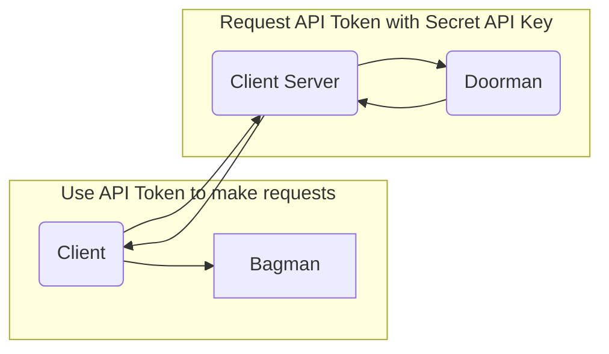

# Doorman
Authentication Server for Bagman

# Motivation 

Bagman is a distributed real-time system that ain to serve traffic from all devices. In order to secure traffic, we have to create a authentication & authorisation solution that works across all devices. 

Doorman act as the guard for Bagman and issue api key & token for authenticated user. 

# Concept

## Permissions

You can define what kind of permissions is allowed to be embedded in your API Key & Token through `doorman.yaml`.

There is one exceptional permission named: `issue:api_token` which allows you to issue short lived API Token given the secret API Key.

## API Key 

There are two types of API Key: `secret` & `publishable`.

>  Please keep your secret API Key safe and grant access only to those who need it.

- Secret API Key has the power to issue short lived API Token for Client to communicate with Bagman Server. 
- Publishable API Key won't be able to issue API Token but can be used as a anonymous token for Client that support anonymous user while having a fine-grain permission.

## API Token 

API Token can be issued by using Secret API Key and make a request to Doorman from the server-side. Token issued from the request can be pass to client-side to interact with the target server.

By sending the userinfo along the request, you can embedded the user info within the token. Any downstream service that consuming would be allow to utilise these data. 

We recommend setting a short expiration for API Token to reduce security risk. 

By default API Token will expire in an hour.

## Use cases

